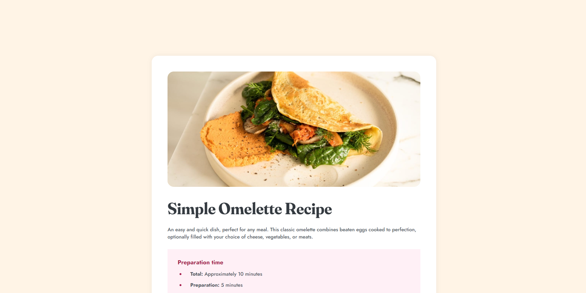
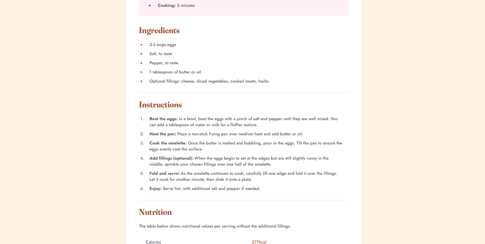
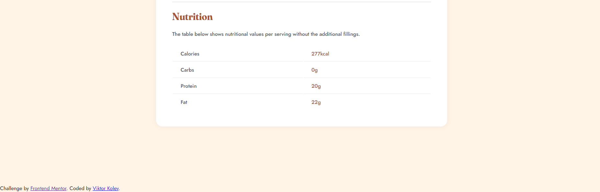

# Frontend Mentor - Recipe page solution

This is a solution to the [Recipe page challenge on Frontend Mentor](https://www.frontendmentor.io/challenges/recipe-page-KiTsR8QQKm). Frontend Mentor challenges help you improve your coding skills by building realistic projects.

## Table of contents

- [Screenshot](#screenshot)
- [Links](#links)
- [Built with](#built-with)
- [What I learned](#what-i-learned)
- [Useful resources](#useful-resources)
- [Author](#author)

### Screenshot

### Links

- Solution URL: [Frontend Mentor Solution](https://www.frontendmentor.io/solutions/recipe-page-with-css-grid-media-queries-semantic-html-etc-UDkgeyZLZK)
- Live Site URL: [GitHub Pages Live Site](https://smithy773.github.io/FM-Recipe/)

### Built with

- Semantic HTML5 markup
- CSS
- Flexbox
- CSS Grid
- Desktop-first approach to the design, but website is still responsive.

### What I learned

Learned to structure code better, keeping it easy to read and modify. Used general classes wherever possible, which made life easier when styling the website. Got good practice in responsive website design.

### Useful resources

- [W3 Schools](https://www.w3schools.com) - Helped me with the exact CSS code needed to style the page.
- [Open-Color](https://yeun.github.io/open-color/) - I decided I was not going to use the preset selected colours and scales, just so I can get some Design practice in.

## Author

- Frontend Mentor - [@smithy773](https://www.frontendmentor.io/profile/smithy773)
- Email - [viktorkolev0707@gmail.com]
